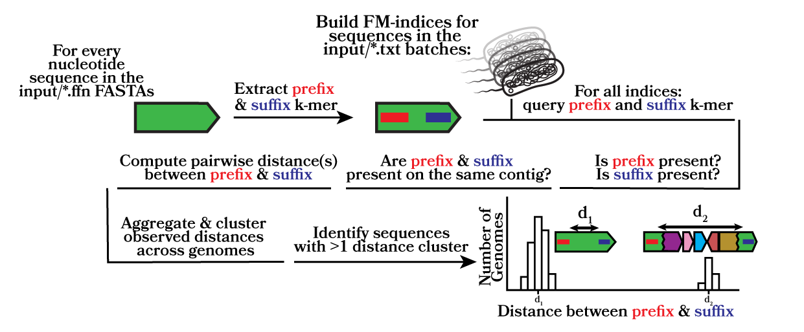

# Prefix-Suffix K-mer Matching

<p>
A scalable workflow for detecting differential genomic distances through rapid k-mer matching. Query sequences are analyzed by extracting prefix and suffix k-mers, which are then mapped across large genome collections to identify regions with unexpected distances between sequence boundaries.

<!--[](https://github.com/aryakaul/prefixsuffix-kmer/actions/workflows/main.yaml)-->

<!--For more information, see the <a href="LOLSOON">associated paper</a>.-->
</p><br/>

<p align="center">
  
</p>

<h2>Contents</h2>

<!-- vim-markdown-toc GFM -->

* [1. Introduction](#1-introduction)
* [2. Dependencies](#2-dependencies)
* [3. Installation](#3-installation)
* [4. Usage](#4-usage)
    * [4a. Basic example](#4a-basic-example)
    * [4b. Adjusting configuration](#4b-adjusting-configuration)
* [5. Citation](#5-citation)
* [6. Issues](#6-issues)
* [7. Changelog](#7-changelog)
* [8. License](#8-license)
* [9. Contacts](#9-contacts)
* [10. Acknowledgements](#10-acknowledgements)


<!-- vim-markdown-toc -->


## 1. Introduction

This workflow implements a scalable k-mer based approach for detecting differential distances in genomic sequences across massive genome collections. The method extracts prefix and suffix k-mers from query sequences and maps them to genome databases using BWA FastMap. By comparing the observed distances between k-mer pairs to their expected distances in the original query sequence, the pipeline identifies regions where sequence boundaries differ.

The approach scales to very large databases. In the paper where we introduce it, we first apply it to [AllTheBacteria](https://allthebacteria.org/) (2.4M+ uniformly QC'd bacterial isolate genomes); however, you can supply any sequence data (i.e. metagenomic sequences)

### How it works

Users provide:
1. **Genome collections** as files-of-files (`.txt`) in the `input/` directory, pointing to tar.xz compressed genome batches
2. **Query sequences** as FASTA files (`.ffn`) representing the sequences to search for

The workflow then:
1. Extracts prefix and suffix k-mers from each query sequence (configurable k-mer length and gap distance)
2. Maps these k-mers to genome collections using BWA fastmap
3. Calculates distances between prefix-suffix pairs within each genome
4. Compares observed distances to the expected distance in the original query sequence
5. Clusters genomes by similar distance patterns using DBSCAN
6. Identifies sequences showing differential distances across the genome collection 

## 2. Dependencies

* [Conda](https://docs.conda.io/en/latest/miniconda.html) (unless the use of Conda is switched off in the configuration) and ideally also [Mamba](https://mamba.readthedocs.io/) (>= 0.20.0)
* [GNU Make](https://www.gnu.org/software/make/)
* [Python](https://www.python.org/) (>=3.7)
* [Snakemake](https://snakemake.github.io) (>=6.2.0)

These can be installed by Conda by
```bash
bash conda install -c conda-forge -c bioconda -c defaults \
  make "python>=3.7" "snakemake>=6.2.0" "mamba>=0.20.0"
```

Other dependencies are installed automatically by
Snakemake when they are requested. The specifications of individual environments can be found in [`workflow/envs/`](workflow/envs/),
and they contain:
- [Pandas](https://pandas.pydata.org/),
- [bwa](https://github.com/lh3/bwa),
- [BioPython](https://biopython.org/wiki/Packages),


All dependencies across all protocols can also be
installed at once by `make conda`.


## 3. Installation

Clone and enter the repository by

```bash
git clone https://github.com/aryakaul/prefixsuffix-kmer
cd prefixsuffix-kmer
```

Alternatively, the repository can also be installed using cURL by
```bash
mkdir prefixsuffix-kmer
cd prefixsuffix-kmer
curl -L https://github.com/aryakaul/prefixsuffix-kmer/tarball/main \
    | tar xvf - --strip-components=1
```


## 4. Usage

### 4a. Basic example

* ***Step 1: Provide lists of input genomes.*** \
  For every batch, create a txt list of input genomes in the `input/`
  directory (i.e., as `input/{batch_name}.txt`. Use either absolute paths (recommended),
  or paths relative to the root of the Github repository (not relative to the txt files).

  Such a list can be generated, for instance, by `find` by
  ```bash
  $ find ~/dir_with_my_genomes -name '*.tar.gz' > input/my_first_batch.txt
  ```
  The supported input file format is a collection of .fa files tar.xz compressed. For
  example,
  ```bash
  $ head -4 input/my_first_batch.txt
  ~/dir_with_my_genomes/staphylococcus_aureus__01.tar.xz
  ~/dir_with_my_genomes/staphylococcus_aureus__02.tar.xz
  ~/dir_with_my_genomes/escherichia_coli__01.tar.xz
  ~/dir_with_my_genomes/escherichia_coli__02.tar.xz

  $ tar -tf ~/dir_with_my_genomes/staphylococcus_aureus__01.tar.xz | head -4
  staphylococcus_aureus__01/SAMN001.fa
  staphylococcus_aureus__01/SAMN002.fa
  staphylococcus_aureus__01/SAMN003.fa
  staphylococcus_aureus__01/SAMN004.fa
  ```
  You can find different large collections of genomes in this format
  (including the 661k collection) here: [MOF collections](https://brinda.eu/mof/#collections)


* ***Step 2: Provide genes.*** \
  The gene files should be named `input/{genes}.ffn`,
  and should be in FASTA format. You can provide multiple
  files.

* ***Step 3 (optional): Adjust configuration.*** \
  By editing [`config.yaml`](config.yaml) it is possible to specify
  value of `k` and other parameters.

* ***Step 4: Run the pipeline.*** \
  Run the pipeline by `make`; this is run by
  Snakemake with the corresponding parameters.

* ***Step 5: Retrieve the output files.*** \
  All output files will be located in `output/`.
  

### 4b. Adjusting configuration

The workflow can be configured via the [`config.yaml`](./config.yaml) file, and
all options are documented directly there. The configurable functionality includes:
* switching off Conda,
* *k* for prefix/suffix k-mer matching
* *g* for gap distance between start and end of the gene


### 4c. List of workflow commands

The pipeline is executed via [GNU Make](https://www.gnu.org/software/make/), which handles all parameters and passes them to Snakemake.
Here's a list of all implemented commands (to be executed as `make {command}`):


```yaml
######################
## General commands ##
######################
    all                  Run everything
    help                 Print help messages
    conda                Create the conda environments
    clean                Clean all output archives and files with statistics
    cleanall             Clean everything but Conda, Snakemake, and input files
    cleanallall          Clean completely everything
###############
## Reporting ##
###############
    viewconf             View configuration without comments
    reports              Create html report
####################
## For developers ##
####################
    test                 Run the workflow on test data
    format               Reformat all source code
    checkformat          Check source code format
```


### 4d. Troubleshooting

Tests can be run by `make test`.


## 5. Citation

If you use this workflow in your research, please cite the associated paper (preprint forthcoming).


## 6. Issues

Please use [Github issues](https://github.com/aryakaul/prefixsuffix-kmer/issues).


## 7. Changelog

See [Releases](https://github.com/aryakaul/prefixsuffix-kmer/releases).


## 8. License

[GPL3](https://github.com/aryakaul/prefixsuffix-kmer/blob/main/LICENSE)


## 9. Contacts

* [Arya Kaul](https://arya.casa) \<arya_kaul@g.harvard.edu\>
* [Karel Brinda](http://karel-brinda.github.io) \<karel.brinda@inria.fr\>


## 10. Acknowledgements

Structure and format for this pipeline, and documentation was heavily inspired 
and modeled after [Miniphy](https://github.com/karel-brinda/Miniphy)! Check it out!
